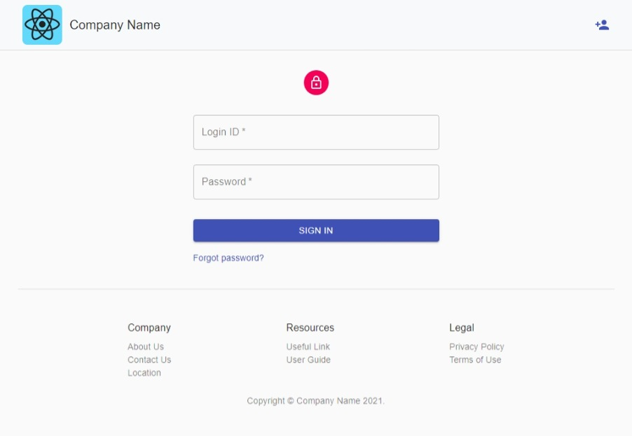
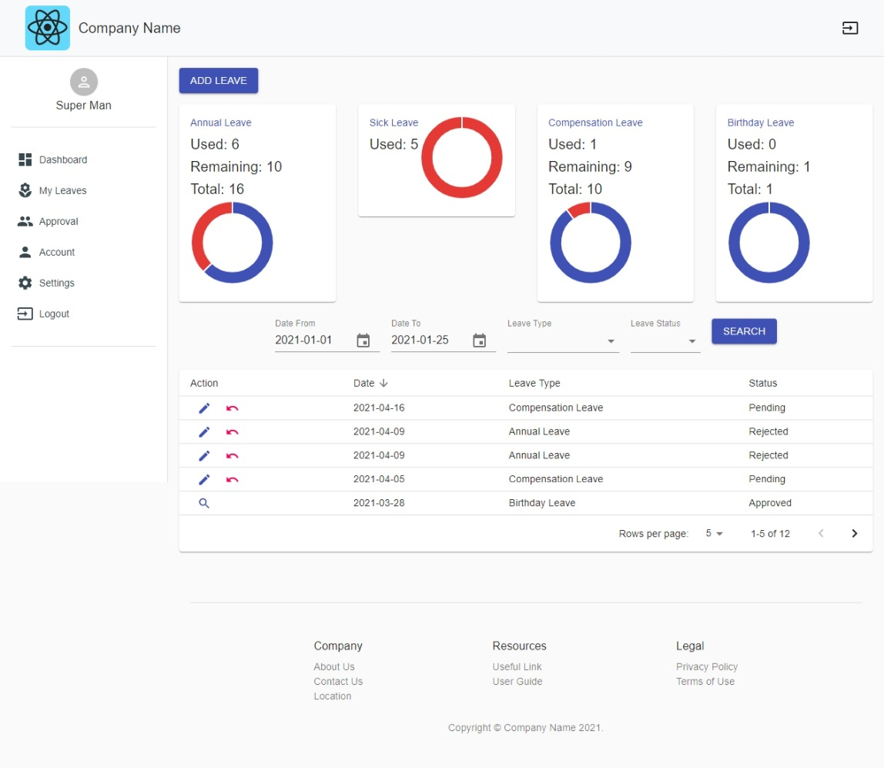
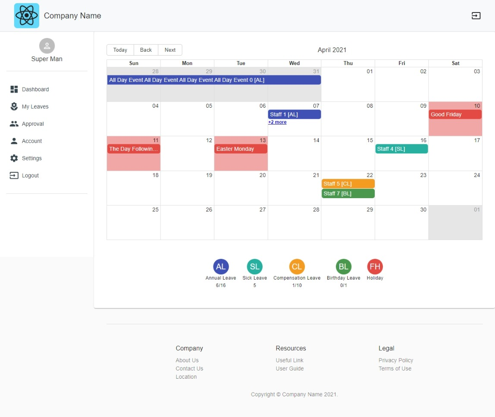
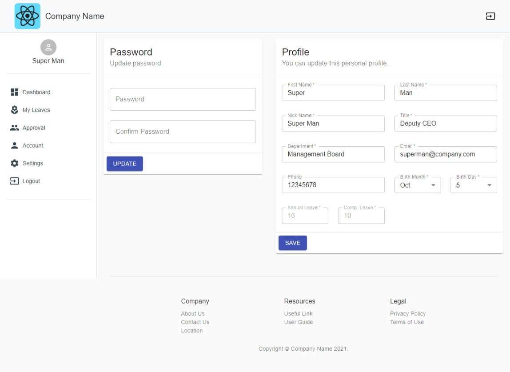

# e-Leave UI Prototype

This project is a preliminary web interface made by React and Node.js with Materialized Design.

# Motivation
Its objective is to allow company staff to apply or cancel any types of leave applications. Admin and staff can review or update records at any times thourgh PC or mobile.

# Install & Start
At first, you need to run
```
npm install
```
Then you can start it up by
```
npm start
```
Open [http://localhost:3000](http://localhost:3000) to view it in the browser.
<br />
The page will reload if you make edits. You will also see any lint errors in the console.

# Sceenshots





# Reference websites
* https://material-ui.com/
* https://jquense.github.io/react-big-calendar/examples/index.html
* https://www.chartjs.org/